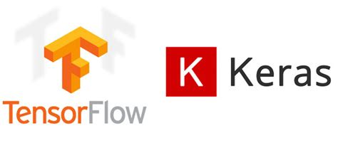
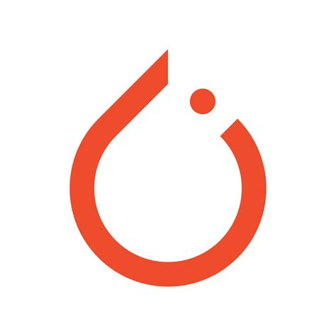
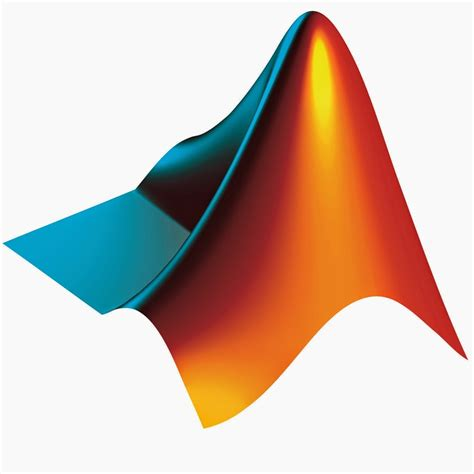
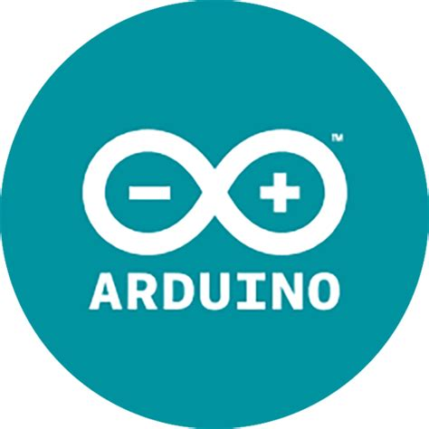

## I'm [Dhiman Seal](https://github.com/dhi13man/), 👋 Welcome to my Comfort Zone!  

### Thank you for taking time to view my profile! &nbsp; 

I'm a third year student 🎓 from National Institute of Technology, Silchar, pursuing a Bachelor of Technology Degree in Electronics and Communication Engineering.🔌📶    

I like to think of myself as a **jack of all trades**,  on my way to master them as I go on, whether it be anything from **`IoT`** 🤖 or **`Deep Learning and Artifical Intelligence`** 🧠, or **`Application Development`** 👨‍💻, or just random factoids about **`Game Theory`** 📊📈. I aim to help come up with scalable solutions to problems, and work with teams that build industry changing technology. I also love to guide and teach with fields I am confident in. 👨‍🏫 
  

[z<code></code>](https://github.com/Dhi13man/CV-HandGestureControl)

---

### Current Targets: 
1. Getting better at writing **optimised**, **readable** and **scalable** code that best utilize handy **Data Structures and Algorithms**.
2. Improving on my **Deep Learning Specialization**.
3. Learning **Flutter** and creating fun Cross-Platform applications.
4. Contributing to **Open Source**.
5. Learning **Reinforcement Learning** and **GAN**s.
5. Implementing Research Papers for skill building.

[<code></code>](https://github.com/Dhi13man/NumCuts) [<code></code>](https://github.com/Dhi13man/SnakeGameAlgo)
[<code></code>](https://github.com/Dhi13man/3Dimensional-Electrostatics-Simulation)

---

### Personal Work and  Growth:

- 🛠 &nbsp; Currently conquering IoT development and Innovation Challenges all over the country with my team, Eminence Robotics.
- 🚀 &nbsp; Currently learning Cross Platform Flutter Development.
- 👨🏻‍💻 &nbsp; Many of my projects are available on [Github](https://github.com/dhi13man).
- 💬 &nbsp; Ask me about anything [here](https://github.com/Dhi13man/dhi13man/issues/1)! I am happy to help.
- 📫 &nbsp; Contact me at: furyx.ds@gmail.com
- 📝 &nbsp; Checkout my [Resume](Dhiiman_Seal_CV.pdf).

### Languages and Tools:

[<code></code>](https://www.cplusplus.com)
[<code></code>](https://www.python.org)
[<code></code>](https://flutter.dev)
[<code></code>](https://www.tensorflow.org)
[<code></code>](https://pytorch.org)
[<code></code>](https://www.javascript.com)
[<code></code>](https://www.java.com)
[<code></code>](https://www.mathworks.com/products/matlab.html)
[<code></code>](https://www.mysql.com)
[<code></code>](https://html.com)
[<code></code>](https://mxnet.apache.org)
[<code></code>](https://opencv.org)
[<code></code>](https://www.arduino.cc)
[<code></code>](https://aws.amazon.com)
  

---

### Future Targets:
1. Learning **Full Stack Development**.
2. **Work Experience** in a competitive, high stakes environment.
3. Learning how to develop **pipelines**, to make my solutions **Cloud Compatible** and **Scalable**.
4. Learning **Natural Language Processing**, my one discomfort in the field of AI.
 

## More Information:

	
  
<b>⚡ Github Stats</b>

 

 

	
   
  
<b>⚙️ My System</b>

  	<ul>
  	    <li><b>OS:</b> Windows 10 and Ubuntu 20.04</li>
	    <li><b>Laptop: </b> Lenovo L340 Gaming (i7 9th Generation Processor with 8GB RAM)</li>
  	    <li><b>Browser: </b> Firefox, Chrome</li>
	    <li><b>Code Editors:</b> I swear by Jetbrains IDEs and VSCode.</li>
	     
	</ul>	

 

----

### Hoping my work inspires you, or teaches you something new! ❤️

