# I'm [Dhiman Seal](https://github.com/dhi13man/), 👋 Welcome to my Comfort Zone

|  |  |  |  |
| :---: | :---: | :---: | :---: |

## Thanks for checking me out! 😉  

|  |
| :------------------: |

I have a Bachelor of Technology in Electronics and Communication Engineering 🔌📶 from the National Institute of Technology (NIT), Silchar 🎓, and I'm a **Full-Stack Software Engineer 2 at [Rippling](https://www.rippling.com/)** 🛠️ on the PEO (B2B HR Services) team, working on Underwriting and Workers' Compensation flows. Before Rippling, I spent **four years at [Groww](https://groww.in/)** 📉💹📈 building payment systems that handle 300K+ transactions a day for 13M+ users.

I like to think of myself as a jack of all trades, and a master of whatever I need to be, whether it be anything from IoT 🤖 or Application Development 👨‍💻, or Deep Learning and Artificial Intelligence 🧠, or just random factoids about Game Theory 📊📈. I aim to help come up with scalable solutions to problems and work with teams that build industry-changing technology. I also love to guide and teach in fields I am confident in. 👨‍🏫

Reach out to me directly on [LinkedIn](https://linkedin.com/in/dhi13man) or [Twitter](https://twitter.com/dhi13man). 💬💬💬

| [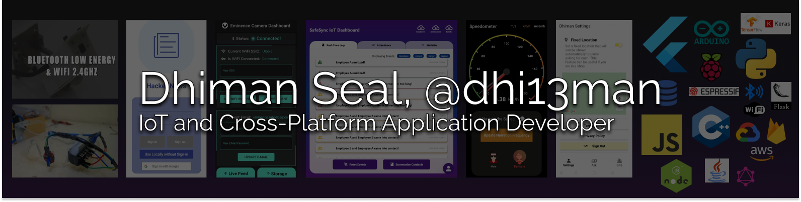](https://linkedin.com/in/dhi13man) |
| :---: |

---

## Current Targets

1. Getting better at building **optimised** and **scalable** solutions that can handle changing requirements.
2. Building **full-stack product features** in HR-tech (underwriting and workers' comp) at Rippling.
3. Shipping **B2B SaaS** products, most recently [EzHomeo](https://www.ezhomeo.com/) (AI tooling for homeopathic practitioners).
4. Contributing to **[Open Source](https://github.com/Dhi13man?tab=repositories)**.

| [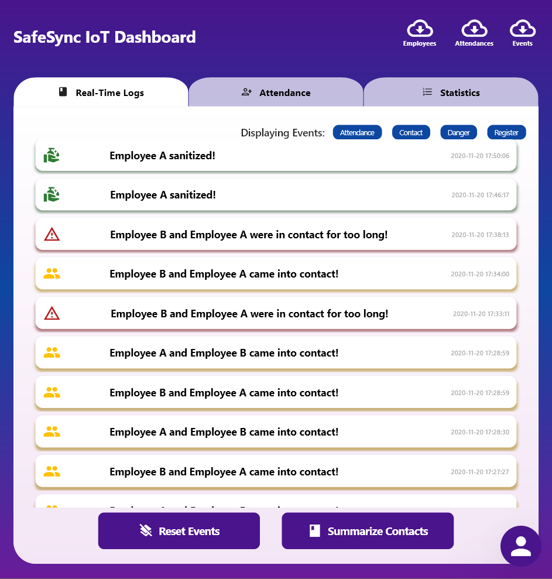](https://github.com/Dhi13man/SafeSyncIoT) | [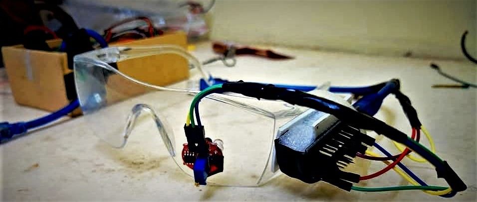](https://www.eminencerobotics.org/) |
| :-------------: | :-------------: |
| [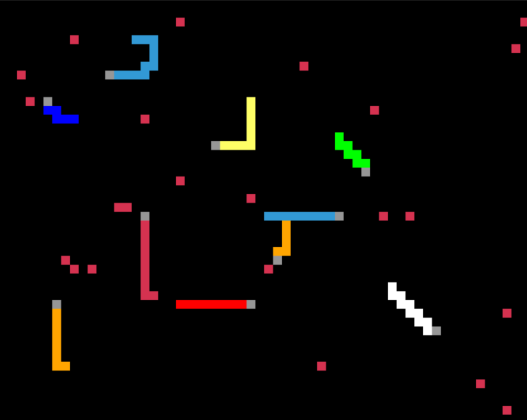](https://github.com/Dhi13man/SnakeGameAlgo) | [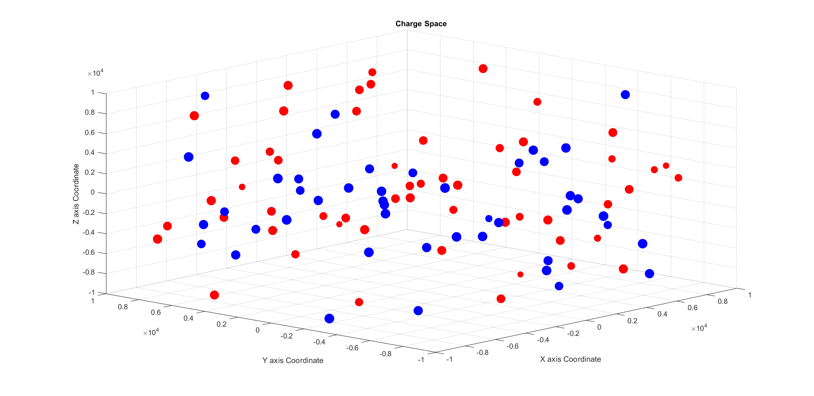](https://github.com/Dhi13man/3Dimensional-Electrostatics-Simulation) |

---

## Personal Work and Growth

- 🛠 &nbsp; Full-stack engineer at Rippling (PEO / B2B HR Services); B2B SaaS and open source on the side.
- 🚀 &nbsp; Founded [AgriJod](https://agrijod.in/) (acquired) and Dostana.AI (ONDC Build-for-Bharat National Runner-up, Tata Imagination Challenge National Winner).
- 👨🏻‍💻 &nbsp; Many of my projects are available on [Github](https://github.com/Dhi13man?tab=repositories).
- 💬 &nbsp; Ask me about anything [here](https://github.com/Dhi13man/dhi13man/issues/1)! I am happy to help.
- 📫 &nbsp; Contact me at: <furyx.ds@gmail.com>
- 📝 &nbsp; See my full experience and projects at [dhimanseal.com](https://www.dhimanseal.com/).

## Languages and Tools

| [<code></code>](https://www.cplusplus.com) | [<code></code>](https://www.python.org) | [<code></code>](https://www.javascript.com) | [<code>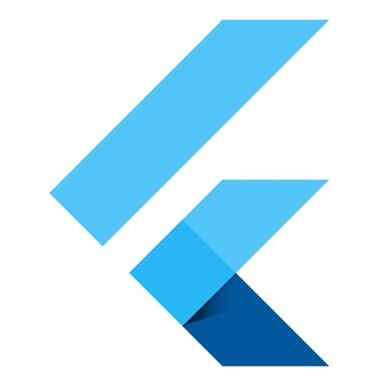</code>](https://flutter.dev) | [<code></code>](https://www.mysql.com) | [<code>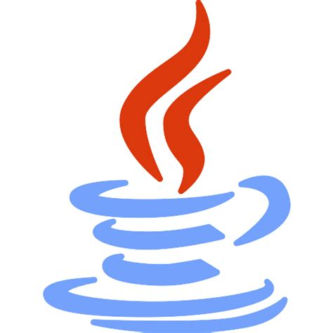</code>](https://www.java.com) | [<code>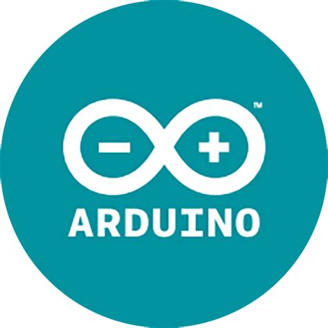</code>](https://www.arduino.cc) | [<code>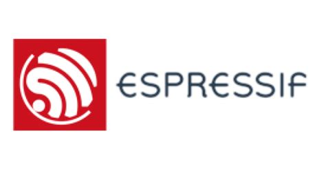</code>](https://www.espressif.com/) | [<code>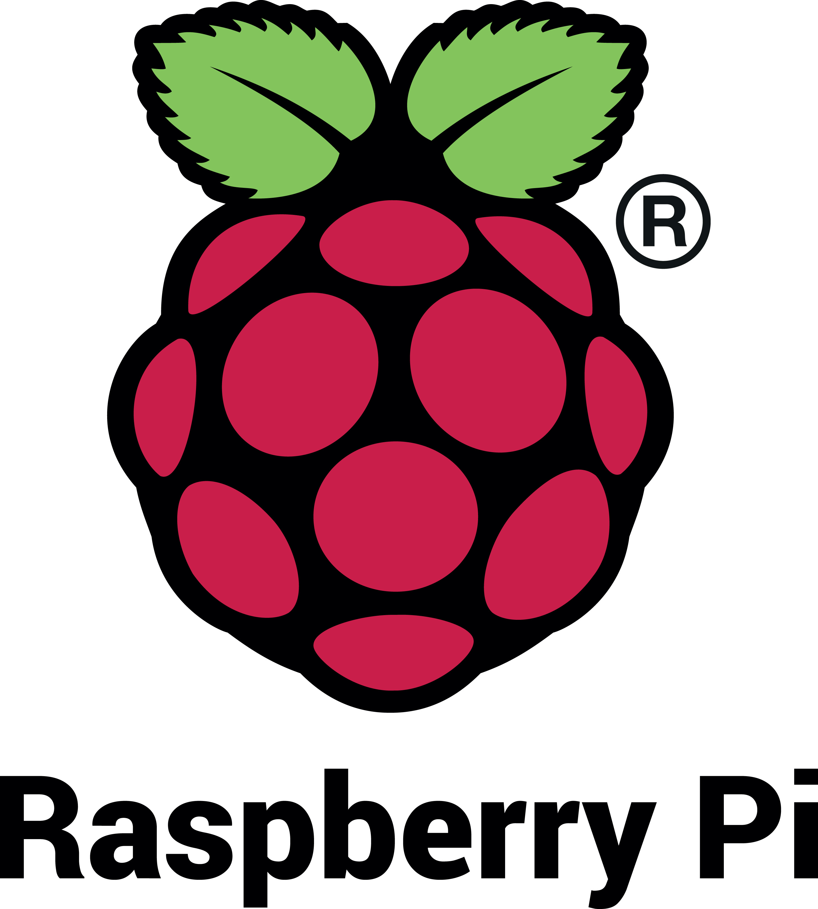</code>](https://www.raspberrypi.org/) | [<code>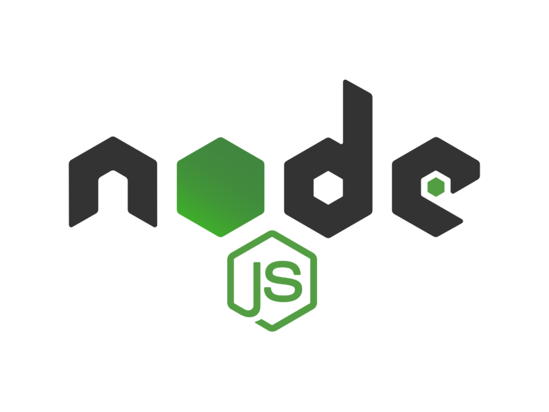</code>](https://nodejs.org/en/) | [<code></code>](https://go.dev) | [<code></code>](https://www.rust-lang.org) |
| :---: | :---: | :---: | :---: | :---: | :---: | :---: | :---: | :---: | :---: | :---: | :---: |
[<code></code>](https://flask.palletsprojects.com/) | [<code></code>](https://firebase.google.com/) | [<code>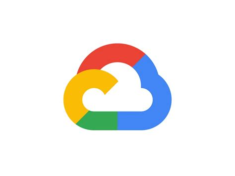</code>](https://cloud.google.com/) | [<code></code>](https://aws.amazon.com) | [<code>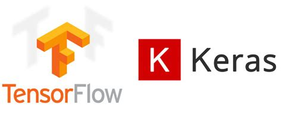</code>](https://www.tensorflow.org) | [<code>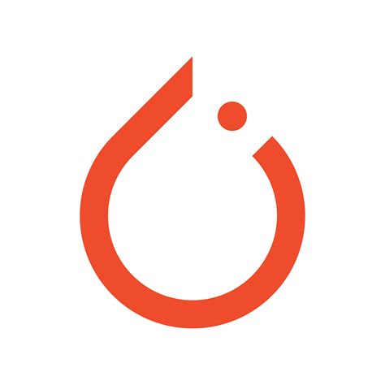</code>](https://pytorch.org) | [<code>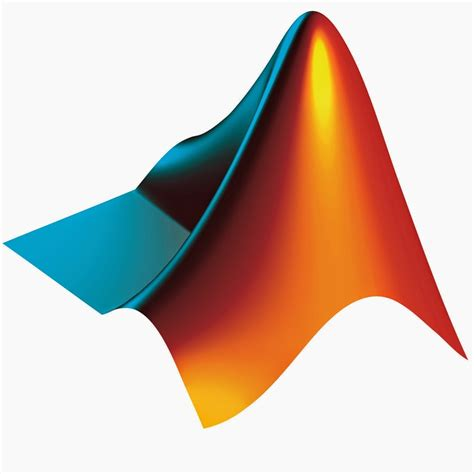</code>](https://www.mathworks.com/products/matlab.html) | [<code>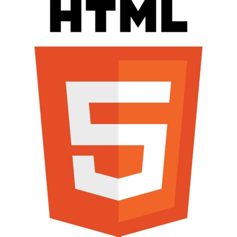</code>](https://html.com) | [<code>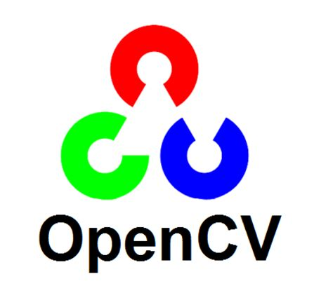</code>](https://opencv.org) | [<code></code>](https://mxnet.apache.org) | [<code></code>](https://kafka.apache.org) |

---

## More Information

|  |  |
|-----------------|----------------------|

### ⚙️ My System

- OS: Windows 11 + WSL2 (Ubuntu)
- Laptop: Lenovo Legion Pro 7 16IAX10H (Intel Core Ultra 9 275HX, 32 GB RAM)
- Browser: Firefox and Chrome
- IDEs: I swear by JetBrains IDEs and VS Code.

### Hoping my work inspires you, or teaches you something new! ❤️
