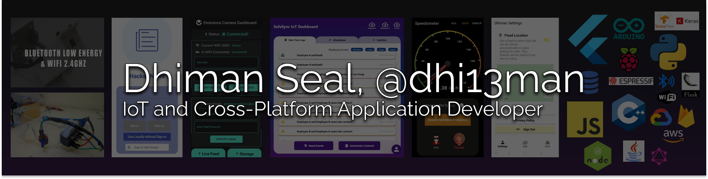

# I'm [Dhiman Seal](https://github.com/dhi13man/), 👋 Welcome to my Comfort Zone

|  |  |  |  |
| :---: | :---: | :---: | :---: |

## Thank you for taking time to view my profile!   

I'm a fourth year student 🎓 from National Institute of Technology, Silchar, pursuing a Bachelor of Technology Degree in Electronics and Communication Engineering.🔌📶

I like to think of myself as a **jack of all trades**, trying to master them as I go on, whether it be anything from **`IoT`** 🤖 or **`Application Development`** 👨‍💻, or  **`Deep Learning and Artifical Intelligence`** 🧠, or just random factoids about **`Game Theory`** 📊📈. I aim to help come up with scalable solutions to problems, and work with teams that build industry changing technology. I also love to guide and teach with fields I am confident in. 👨‍🏫

You can hire me on [Fiverr](https://www.fiverr.com/dhiman13), or reach out to me directly on [LinkedIn](https://linkedin.com/in/dhi13man) or [Twitter](https://twitter.com/dhi13man). 💬💬💬

| Have an Overview! |
| :---------------: |
|  |

Creating Cool Flexes:
https://raw.githubusercontent.com/Dhi13man/CV-HandGestureControl/master/Examples/cvgesture.mp4

---

## Current Targets

1. Getting better at writing **optimised**, **readable** and **scalable** code that best utilize handy **Data Structures and Algorithms**.
2. Freelancing in the **`IoT`** and **`Application Development`** space.
3. Learning **Flutter** and creating fun Cross-Platform applications and Packages.
4. Contributing to **[Open Source](https://github.com/Dhi13man?tab=repositories)**.
5. Learning various **ML/DL** topics and **Blockchain Development** on the side.
6. Implementing Research Papers for skill building.

|  |  |
| :-------------: | :-------------: |

|  |  |
| :-------------: | :-------------: |

---

## Personal Work and Growth

- 🛠   Currently conquering IoT development and Innovation Challenges all over the country with my team, Eminence Robotics.
- 🚀   Developing Cross Platform Applications for myself and my clients.
- 👨🏻‍💻   Many of my projects are available on [Github](https://github.com/Dhi13man?tab=repositories).
- 💬   Ask me about anything [here](https://github.com/Dhi13man/dhi13man/issues/1)! I am happy to help.
- 📫   Contact me at: furyx.ds@gmail.com
- 📠  Checkout my [Resume](https://drive.google.com/file/d/17TrMgHoc7ZR2nsKijzk4slW5lATGI5AN/view?usp=sharing).

## Languages and Tools

| [<code></code>](https://www.cplusplus.com) | [<code></code>](https://www.python.org) | [<code></code>](https://www.javascript.com) | [<code></code>](https://flutter.dev) | [<code></code>](https://www.mysql.com) | [<code></code>](https://www.java.com) | [<code></code>](https://www.arduino.cc) | [<code></code>](https://www.espressif.com/) | [<code></code>](https://www.raspberrypi.org/) | [<code></code>](https://nodejs.org/en/) |
| :---: | :---: | :---: | :---: | :---: | :---: | :---: | :---: | :---: | :---: |
[<code></code>](https://flask.palletsprojects.com/) | [<code></code>](https://firebase.google.com/) | [<code></code>](https://cloud.google.com/) | [<code></code>](https://aws.amazon.com) | [<code></code>](https://www.tensorflow.org) | [<code></code>](https://pytorch.org) | [<code></code>](https://www.mathworks.com/products/matlab.html) | [<code></code>](https://html.com) | [<code></code>](https://opencv.org) | [<code></code>](https://mxnet.apache.org) |

## Future Targets

1. Getting large Scale **Full Stack Application Development** Experience.
2. **Work Experience** in a competitive, high stakes environment.
3. Learning how to create efficient **development pipelines** to improve workflow.
4. Learning **Natural Language Processing**, my one discomfort in the field of AI.

---

## More Information

### ⚙️ My System

- OS: Windows 10 and Ubuntu 20.04
- Laptop: Lenovo L340 Gaming (i7 9th Generation Processor with 8GB RAM)
- Browser: Firefox, Chrome
- IDEs: I swear by Jetbrains IDEs and VSCode.

### Hoping my work inspires you, or teaches you something new! ❤️
